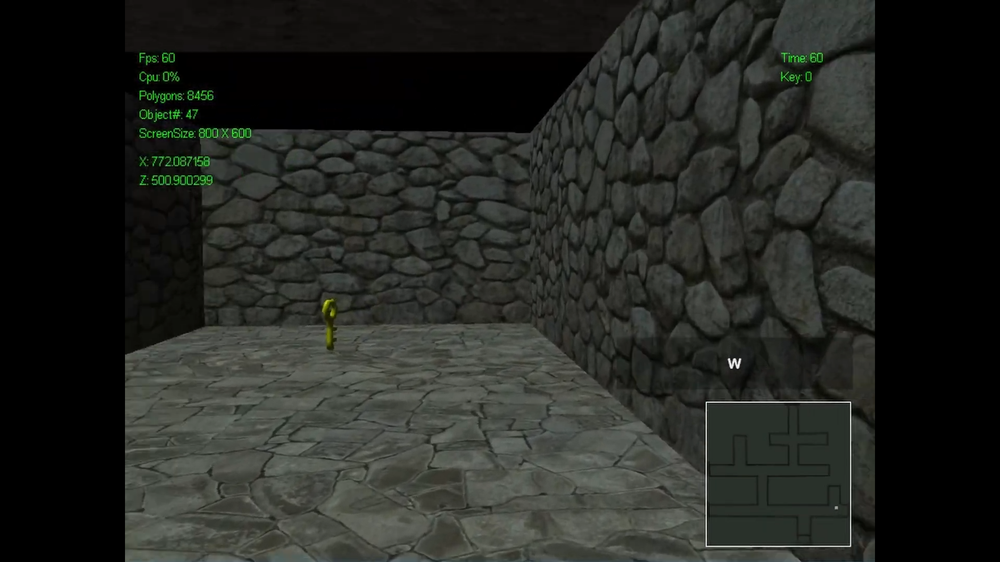
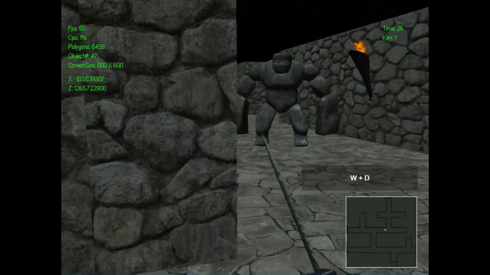
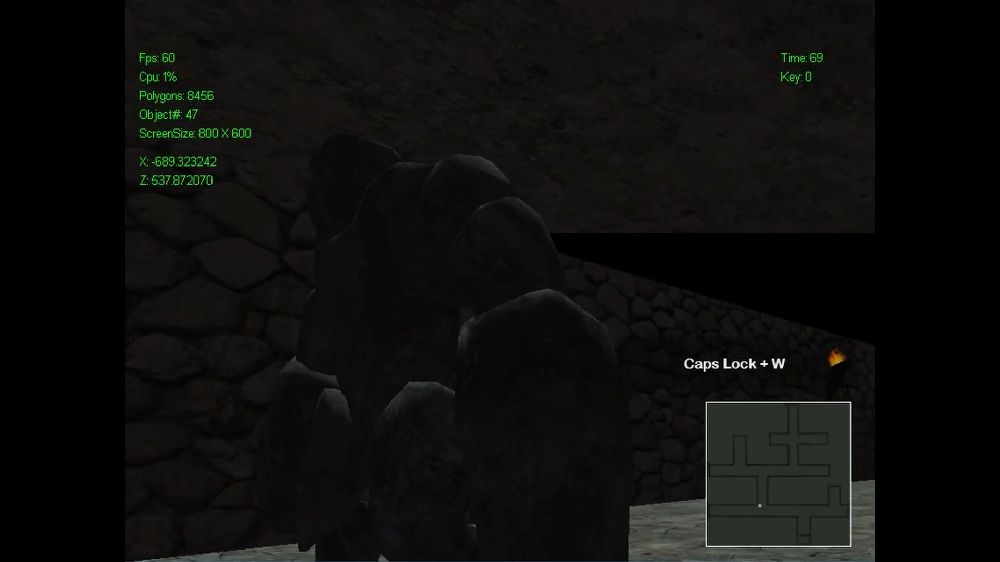
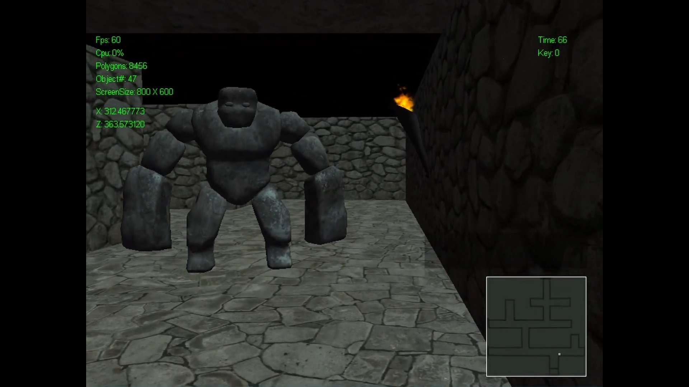

# Maze Game - DirectX 11 Project

# 👉개요

## 게임 개요

- **게임 이름 : Maze Game**
- **장르 : 액션 어드벤처 게임**
- **사용 API : DirectX 11**
- **목적 : DirectX API를 이용한 게임 개발**
- **제작 기간 : 2020.05 - 2020.06**
- **제작 인원 : 2명**

## 게임 이미지

# 👉특징

## 담당 업무

**✔ 게임 기획**

**✔ 게임 개발 파이프 라인 구축**

## 구현 내용

✔ DirectX 11 API를 이용한 파이프 라인 구축

✔ 객체 지향 개념 이용

✔ 더블 버퍼링을 이용한 테어링 방지 구현

✔ OBJ 파일 Parser 구현

✔ 직육면체의 간단한 충돌체 구현

# 👉참고 링크

- **유튜브 : [https://youtu.be/vvKFHcwUXts](https://youtu.be/vvKFHcwUXts)**
- **Git Hub : [https://github.com/yoonsangmin/DirectXProject](https://github.com/yoonsangmin/DirectXProject)**

## 영상

